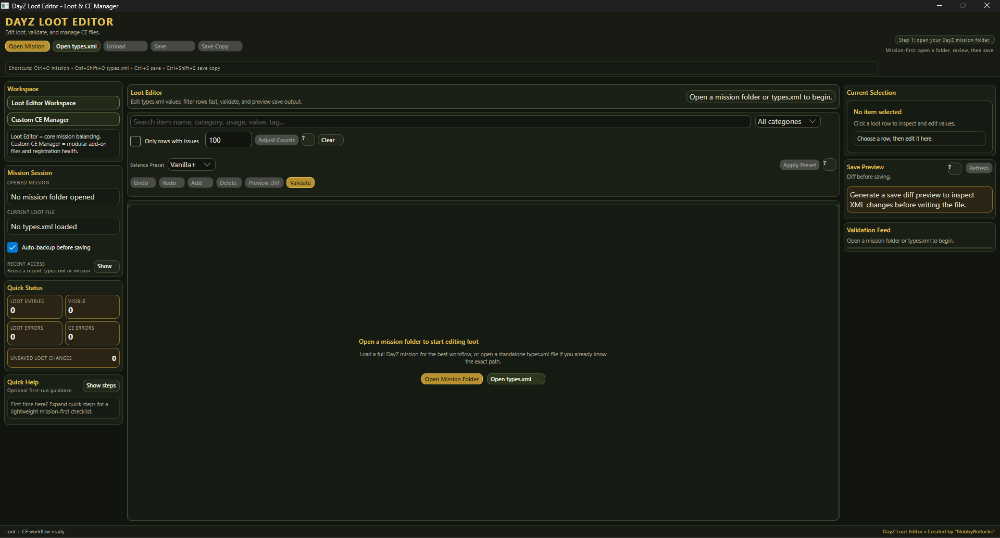
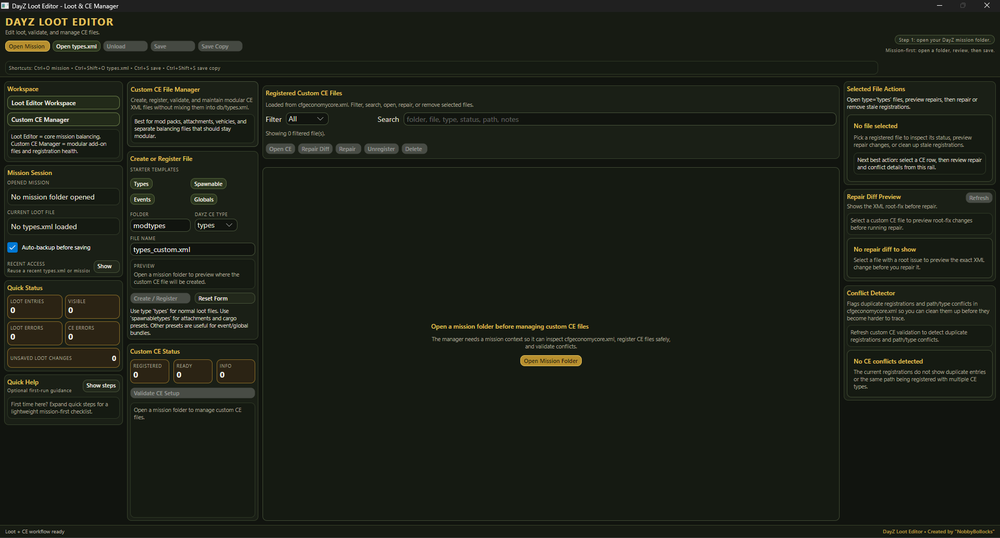
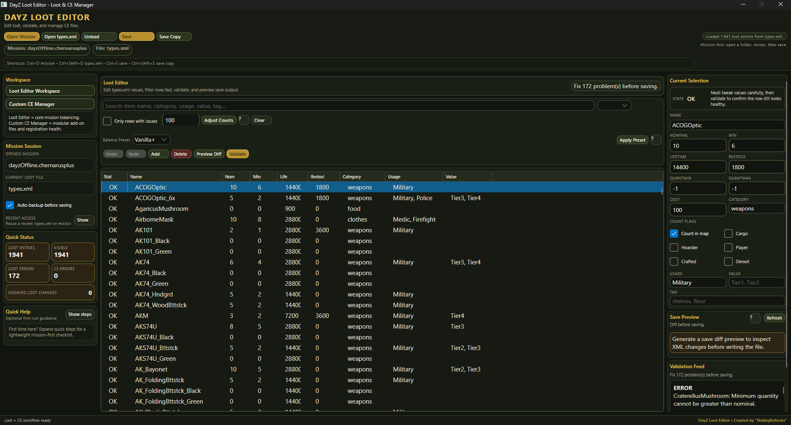
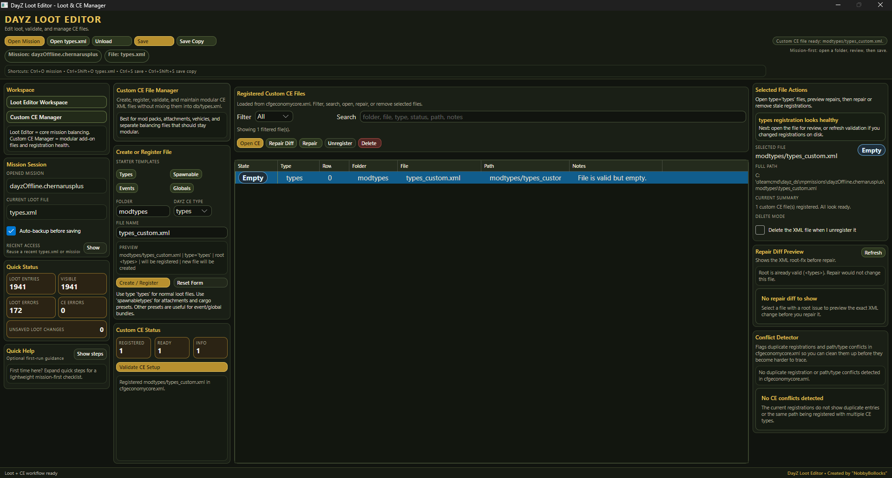
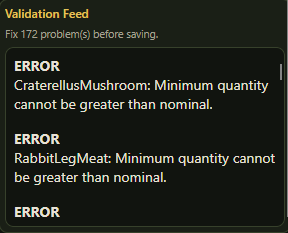

# DayZ Loot Editor

**A Windows desktop editor for DayZ loot balancing and custom CE file management**

Safer saves, cleaner workflows, modular CE support, and a validation feed that helps catch broken values **before** they hit your server.

  
  
  
  
  

---

## Overview

**DayZ Loot Editor** is made for server owners and modders who want a faster, safer way to work with:

- `db/types.xml`
- `cfgeconomycore.xml`
- modular custom CE files such as `types`, `spawnabletypes`, `events`, and `globals`

Instead of hand-editing raw XML and hoping nothing breaks, the app gives you a focused workflow for editing, validating, previewing, and saving your economy files with more confidence.

---

## Why this tool exists

Manual DayZ economy editing is powerful, but it is also easy to break:

- values can drift out of range
- `min` can end up higher than `nominal`
- stale CE registrations can pile up
- custom CE files can become messy or inconsistent
- one bad save can cause server-side headaches

This tool is built to reduce that friction with a proper desktop workflow.

---

## Features

### Loot Editor
- Open a mission folder and auto-target `db/types.xml`
- Open a standalone `types.xml` directly
- Search by item name, category, usage, value, and tags
- Edit core loot values in a cleaner table + side panel workflow
- Add and delete entries
- Filter to only problematic rows
- Apply balance presets
- Preview save diffs before writing XML
- Validate entries before saving

### Custom CE Manager
- Inspect CE registrations loaded from `cfgeconomycore.xml`
- Create and register modular custom CE files
- Use starter templates for `types`, `spawnabletypes`, `events`, and `globals`
- Review file path, type, and state in one list
- Preview repair diffs
- Repair root-tag issues
- Unregister stale entries safely
- Keep modular balancing files separate from the main `types.xml`

### Validation Feed
One of the nicest parts of the tool is the **Validation Feed** on the right side of the editor.

It gives quick, visible feedback on problems that should be fixed before saving, instead of leaving you to discover them later in a broken mission setup.

It helps catch issues like:

- `minimum quantity cannot be greater than nominal`
- invalid count relationships
- broken loot values
- registration/setup issues with custom CE files

That makes balancing safer and much less guessy, especially when working through a large `types.xml`.

---

## Screenshot Tour

### Start screen
Open a mission folder or a standalone `types.xml` to begin.

### Custom CE Manager
Create, register, validate, and maintain modular CE XML files without mixing them into the main loot file.

### Loot Editor in use
Search, review, edit, and validate live loot entries from `types.xml`.

### Registered Custom CE files
See registered custom files, their root type, path, status, and available actions.

### Validation Feed in action
The validation panel makes real data issues obvious before save time.

---

## Typical Workflow

1. Open your DayZ mission folder.
2. Let the app load `db/types.xml`.
3. Search or filter the entries you want to work on.
4. Edit values and keep an eye on the **Validation Feed**.
5. Use **Preview Diff** to inspect XML changes.
6. Save changes with **Auto-backup before saving** enabled.
7. Use **Custom CE Manager** to create or maintain modular CE files registered in `cfgeconomycore.xml`.

---

## Supported Custom CE Root Types

| CE type | Root tag |
|---|---|
| `types` | `<types>` |
| `spawnabletypes` | `<spawnabletypes>` |
| `events` | `<events>` |
| `eventspawns` | `<eventposdef>` |
| `globals` | `<variables>` |

---

## Build From Source

### Requirements
- Windows
- .NET 10 SDK
- Visual Studio
- NuGet access

## License

This project is source-available for **personal, non-commercial use only**.

Not allowed without prior written permission:

- monetizing
- reuploading
- redistributing
- repackaging
- public modified releases

See `LICENSE.txt` for the full terms.

---

## Credits

Created by **"NobbyBollocks"**

Discord: https://discord.gg/QwZzkyR3dk
